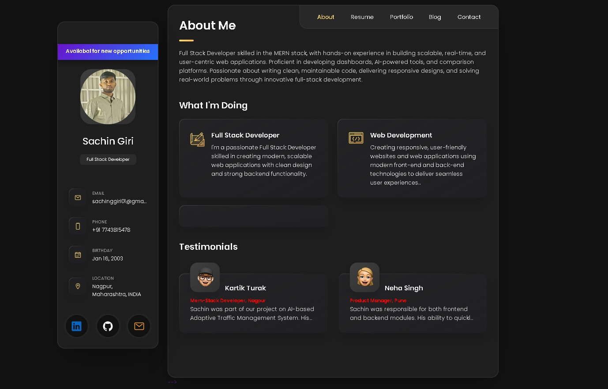
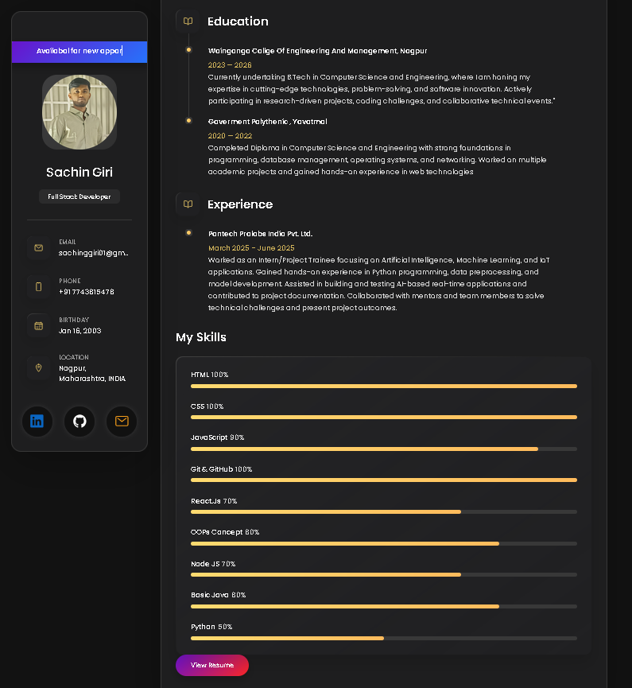
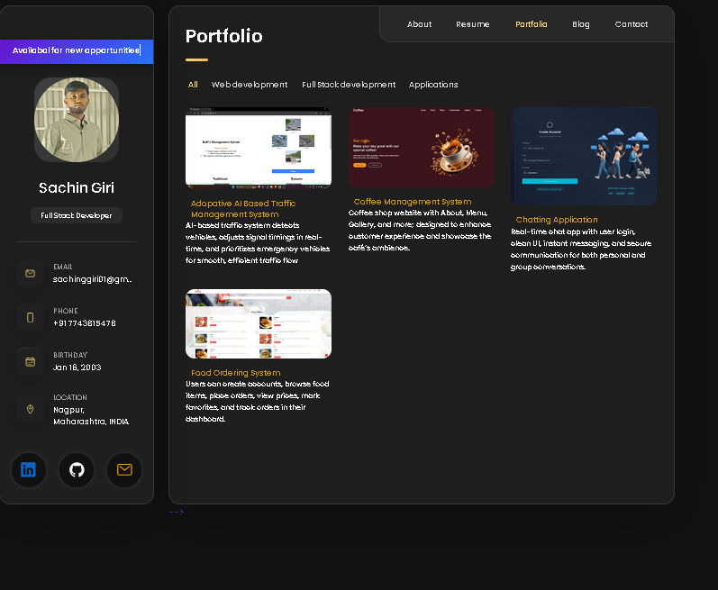
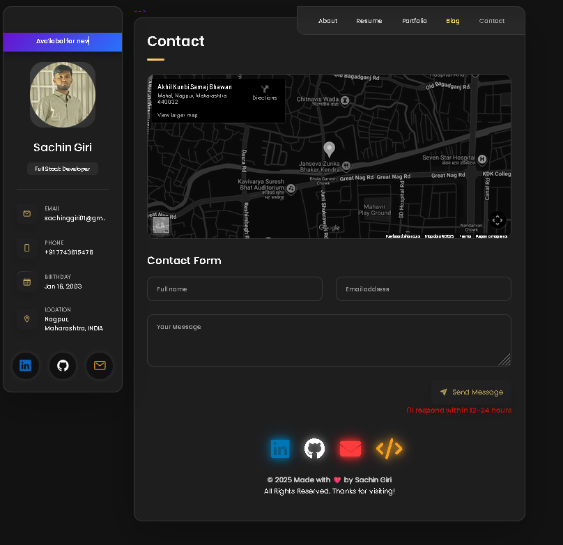

# 💼 Sachin Giri - Personal Portfolio

[GitHub Repository](https://github.com/sachingiri58/Sachin_Portfolio)

 Sachin Giri is a fully responsive personal portfolio website, optimized for **all devices**, built using **HTML, CSS, and JavaScript**.  
Showcases my **skills, education, projects, and contact information** in a clean, modern design.

---

## 🌐 Demo Screenshots

### Desktop


### Education Section


### Projects Section


### Contact Section


---

## ⚡ Features

- Fully **responsive layout** for desktop, tablet, and mobile devices  
- **About Me** section with professional information  
- **Resume/Skills** section showcasing education, internships, programming skills and Resume PDF format  
- **Projects** section with descriptions and images of each project  
- **Contact Form** integrated for email communication  
- **Social Links**: LinkedIn, GitHub, LeetCode, Email  

---

## 🛠️ Prerequisites

Before running this project, make sure you have:

- **Git** installed on your system: [Download Git](https://git-scm.com/downloads)  

Clone the repository:

```bash
# Linux / macOS
sudo git clone https://github.com/sachingiri58/Sachin_Portfolio.git

# Windows
git clone https://github.com/sachingiri58/Sachin_Portfolio.git
